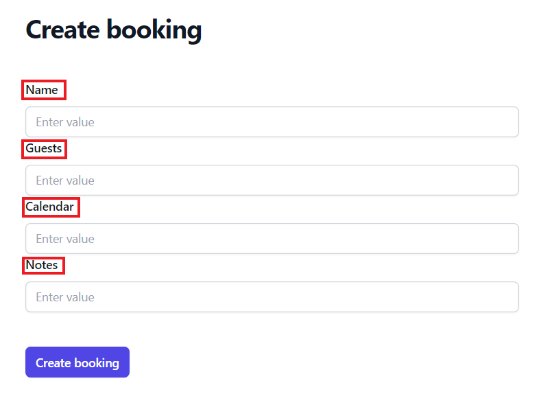
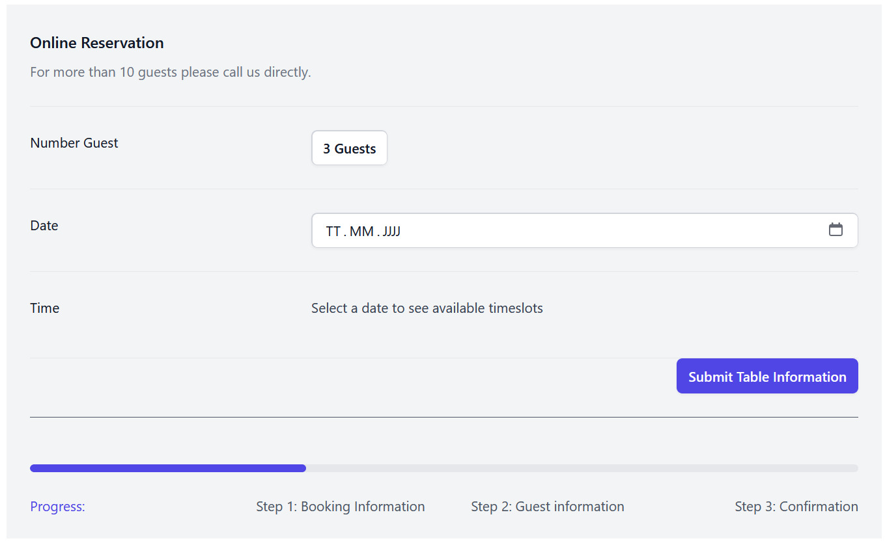
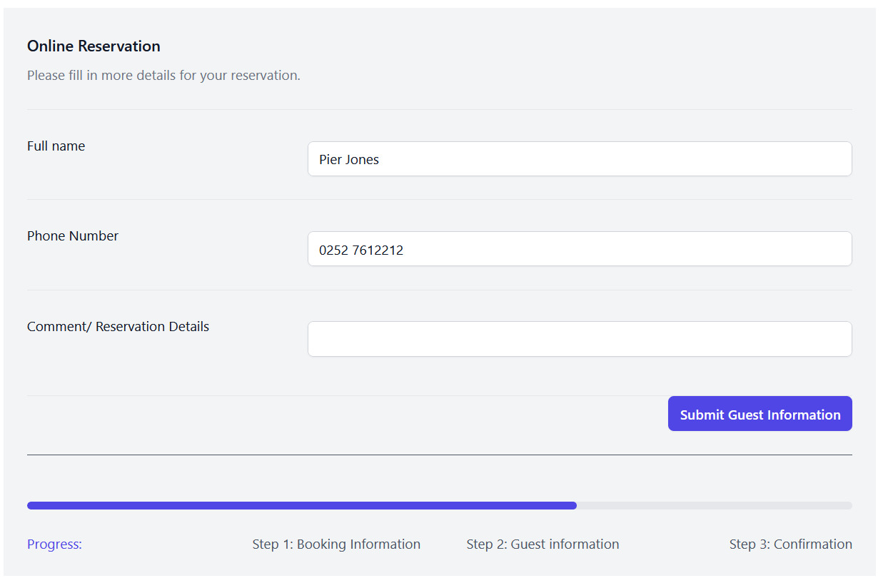
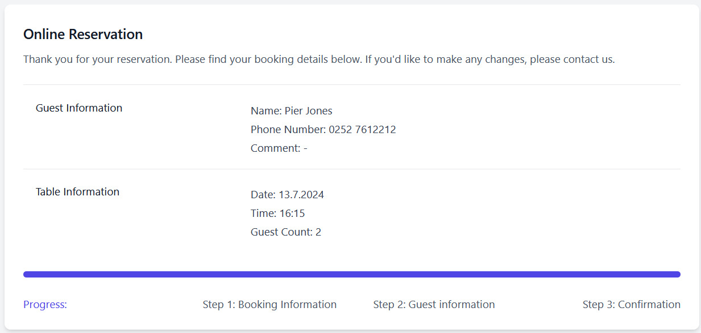

# PlatzKieker: User Documentation

## Table of Contents
- [Overview](#overview)
- [Restauranteur Perspective](#restauranteur-perspective)
    - [Accessing the Website](#accessing-the-website)
    - [Login/Register](#loginregister)
    - [Dashboard](#dashboard)
        - [Overview](#overview)
        - [Editing Table Bookings](#editing-table-bookings)
        - [Creating New Bookings](#creating-new-bookings)
    - [Settings](#settings)
        - [Overview](#overview-1)
        - [Restaurant Information and Zones & Tables](#restaurant-information-and-zones--tables)
            - [Restaurant Information](#restaurant-information)
            - [Zones](#zones)
            - [Tables](#tables)
        - [Booking Periods](#booking-periods)
        - [Vacations](#vacations)
- [Guest Perspective](#guest-perspective)
    - [Accessing the Website](#accessing-the-website-1)
    - [Online Reservation Process](#online-reservation-process)
        - [Booking Information](#booking-information)
        - [Guest Information](#guest-information)
        - [Confirmation](#confirmation)

## Overview

Welcome to Platzkieker, your go-to platform for online table reservations and restaurant management. This documentation provides a comprehensive guide to using Platzkieker from both the restauranteur's and the customer's perspective. Let's get started!

## Restauranteur Perspective

### Accessing the Website

To access the website, type `platzkiecker.de` in your web browser.

### Login/Register

To access our website, users must [register](https://platzkiecker.de/register). An email and password are required.

If the user has already registered, they can log in on our [login page](https://platzkiecker.de/login) using their email and password.

### Dashboard

Once you are logged in, you will see our Dashboard displaying the current table bookings.

#### Overview

The dashboard provides an overview of the reservations, including the start time, approximate duration, and the number of reserved tables and guests. Bookings can be filtered by date (today, tomorrow, exact date). The reservation is listed under the name of the person who made it; this person can also leave a note for the restauranteur. The current status of the booking is displayed in the ‘Status’ column (canceled, confirmed, pending).

#### Editing Table Bookings

If a reservation needs to be corrected, existing reservations can be edited using the **Edit** button. This action opens the ‘Edit booking’ mask, where all data (name, guests, calendar, notes) of the booking can be changed and confirmed using the ‘Update booking’ button.

#### Creating New Bookings

With the ‘new booking’ button in the dashboard, a new mask named ‘Create booking’ opens, allowing bookings to be entered manually by the restauranteur. If a guest books a table by phone or comes into the restaurant asking for a table, the restaurateur can book the table themselves. The structure is the same as for the customer view (Name, Guests, Calendar, Notes). The booking is confirmed using the 'Create booking' button.

### Settings

#### Overview

In the Settings area, options can be configured according to the wishes of the restaurant owner.

#### Restaurant Information and Zones & Tables

##### Restaurant Information

The name of the restaurant can be entered in this area. You can also set a default value for the booking duration in hours by entering a number or using the up/down buttons.  
Note: name and default booking duration are required fields.

##### Zones

A restaurant can create various zones to organize its seating areas. A zone is defined by a name (e.g., "Inside," "Outside," "Upstairs," "Downstairs") and includes an attribute called "bookable." This attribute indicates whether the tables in that zone can be reserved.  
Note: name is a required field.

![Zones] screenshot hinzufügen

##### Tables

A restaurant can create an individual table within a restaurant using the table module, including its name, the capacity, (if it is bookable, and the associated zone. muss klären, ob das im frontend sichtbar ist) A table ID will be automatically generated when creating a new table.  
Note: capacity and zone are required fields.

#### Booking Periods

In this area, the opening times of the restaurant can be set by pressing the ‘+’ button for entering the times corresponding to the days of the week. If needed, several time intervals can be entered per day to determine when the restaurant has its break time on that day. Thus, rest days can also easily be created by not determining any bookable periods on the specific day.

#### Vacations

Restaurant holidays can be set in this tab. As soon as you click on the field, a calendar appears where you can set the time interval. Multiple vacation periods can be entered using the '+'.

## Guest Perspective

### Accessing the Website

To access the website, type `platzkiecker.de/tablereservation` in your web browser.

You will see our Online Reservation Portal.

### Online Reservation Process

The Online Reservation Process is divided into three steps:
1. Booking Information
2. Guest Information
3. Confirmation

#### Booking Information

The first step asks for the number of guests, date, and exact time. Confirm this step with the ‘Submit Table Information’ button. If the number of guests is higher than 10, please make the booking by calling the restaurant directly.

#### Guest Information

In the second step, the full name of the person making the booking is requested. A telephone number is also required for queries and confirmations. Specific details can be referenced in the 'Comment/Reservation Details' area. 'Full name' and 'phone number' fields must be filled out, the 'comment' field is optional.

#### Confirmation

In the final step, a booking confirmation with the details of the booking is displayed. All data from the previous steps are summarized here (name, telephone number, comment, date, time, number of guests). Please note that if something needs to be changed, you should contact the restaurant directly. The booking will then be displayed on the restaurant owner's dashboard.

