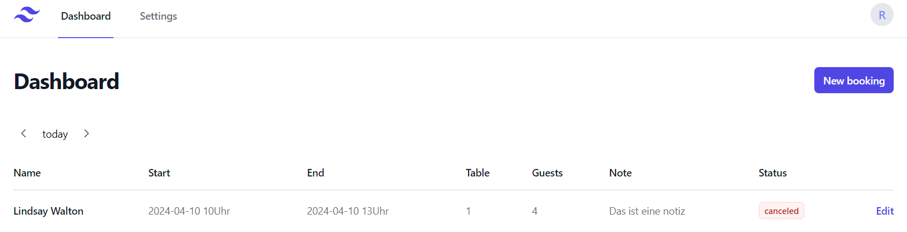

# PlatzKieker: User Documentation

## Table of Contents
- [Overview](#overview)
- [Gastronome Perspective](#gastronome-perspective)
    - [1. Accessing our website](#1-accessing-our-website)
- [Dashboard](#dashboard)
    - [1. Overview](#1-overview)
    - [2. Edit table bookings](#2-edit-table-bookings)
    - [3. Create new bookings](#3-create-new-bookings)
- [Settings](#settings)
    - [1. Overview](#1-overview-1)
    - [2. Restaurant Information and Tables & Zones](#2-restaurant-information-and-tables--zones)
        - [2.1 Restaurant Information](#21-restaurant-information)
        - [2.2 Tables & Zones](#22-tables--zones)
    - [3. Booking periods](#3-booking-periods)
    - [4. Vacations](#4-vacations)
- [Guest Perspective](#guest-perspective)
    - [1. Accessing our website](#1-accessing-our-website-1)
    - [2. Online Reservation Progress](#2-online-reservation-progress)
        - [2.1 Booking Information](#21-booking-information)
        - [2.2 Guest Information](#22-guest-information)
        - [2.3 Confirmation](#23-confirmation)

## Overview

Welcome to Platzkieker, your go-to platform for online table reservations and restaurant management. This documentation provides a comprehensive guide to using Platzkieker from two perspectives: the Gastronome (Restaurant Owner) and the Customer. Let's get started!

## Gastronome Perspective

### 1. Accessing our website

To access the website, type `platzkiecker.de` in your web browser.

You will see our Dashboard with the current table bookings.

## Dashboard

### 1. Overview

Our dashboard gives the user an overview of the reservations, including the start of the stay, the approximate duration, and the number of reserved tables and guests. Bookings can be filtered by date (today, tomorrow, exact date). The reservation is made under the name of the person who made the reservation; this person can also leave a note as a note for the restaurateur. The current status of the booking is displayed in the ‘Status column’ (canceled, confirmed, pending).

### 2. Edit table bookings

If the case arises that a reservation needs to be corrected, existing reservations can be edited using the **Edit** button. This action opens the ‘Edit booking’ mask:

All data (name, guests, calendar, notes) of the booking can be changed in the mask and confirmed using the ‘Update booking’ button.

### 3. Create new bookings

With the ‘new booking’ button in the dashboard, a new mask opens named ‘Create booking’ with that, bookings can be entered manually by the restaurateur:

If a guest books a table by phone or just enters the restaurant and wants a table, the restaurateur can book the table himself. The structure is the same as for the customer view (Name, Guests, Calendar, Notes). The booking is confirmed using the 'Create booking' button.

## Settings

### 1. Overview

In the Settings area, the options can be configured depending on the wishes of the restaurant owner:

### 2. Restaurant Information and Tables & Zones

#### 2.1 Restaurant Information

The name of the restaurant can be entered in this area. You can also set a default value for the booking duration in hours by entering a number or by using the up/down buttons.

#### 2.2 Tables & Zones

In this area you can create tables by entering names for them. The number of chairs is determined and a table ID is generated.

Zones can also be created (for example inside- or outside area).

### 3. Booking periods

In this area, the opening times of the restaurant can be set by pressing the ‘+’ button for entering the times corresponding to the days of the week. Several time intervals can be entered per day to determine when the restaurant has its break time on that day.

### 4. Vacations

Restaurant holiday times can be set in this tab. As soon as you click on the field, a calendar appears where you can set the time interval. Multiple vacation periods can be entered using the '+'.

## Guest Perspective

### 1. Accessing our website

To access the website, type `localhost:3000/tablereservation` in your web browser.
> stimmt nicht

You will see our Online Reservation Portal.

### 2. Online Reservation Progress

The Online Reservation Progress is divided into 3 steps:
- Step 1: Booking Information
- Step 2: Guest Information
- Step 3: Confirmation.

#### 2.1 Booking Information

The first step is to ask how many guests there are. The date and exact time are also required. You confirm the step with the ‘Submit Table Information’ Button. If the number of guests is higher than 10, please make the booking by calling the restaurant directly.

>Bild fehlt

#### 2.2 Guest Information

In the second step, the full name of the person making the booking is requested. A telephone number is also required for queries and confirmations. Specific details can be referenced in the 'Comment/Reservation Details' area. All fields must be filled in before confirming.

#### 2.3 Confirmation

In the last step, a booking confirmation with the details of the booking is displayed. All data from the previous steps are summarized here (name, telephone number, comment, date, time, number of guests). Please note that if something needs to be changed, you should contact us. The booking made will then be displayed on the restaurant owner's dashboard.

