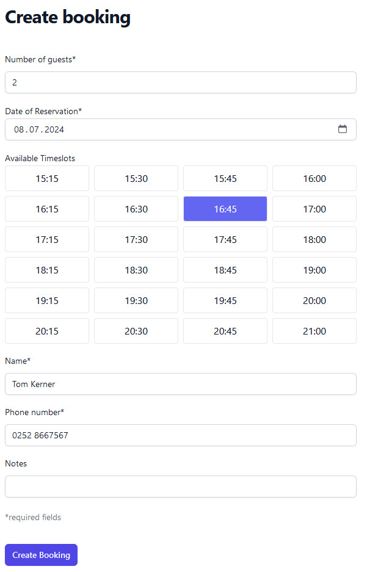
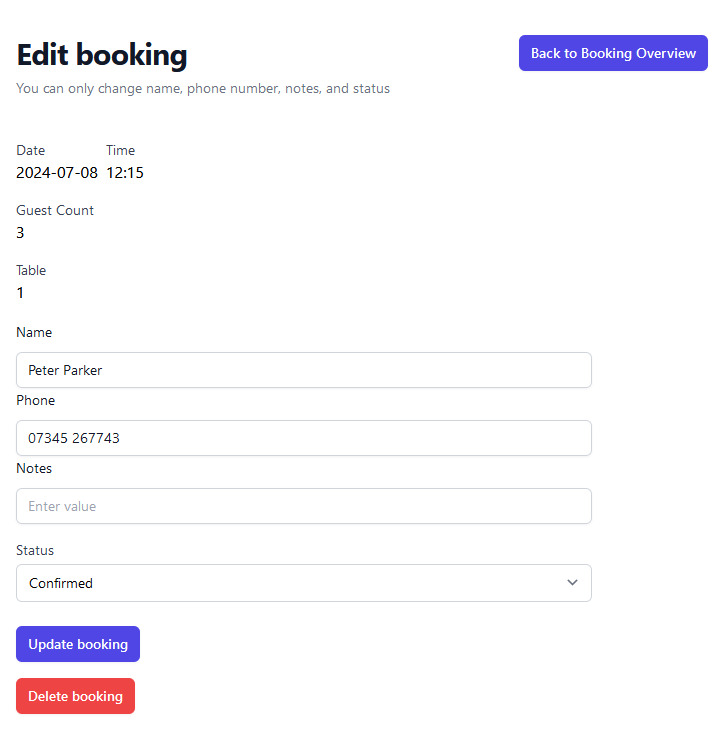
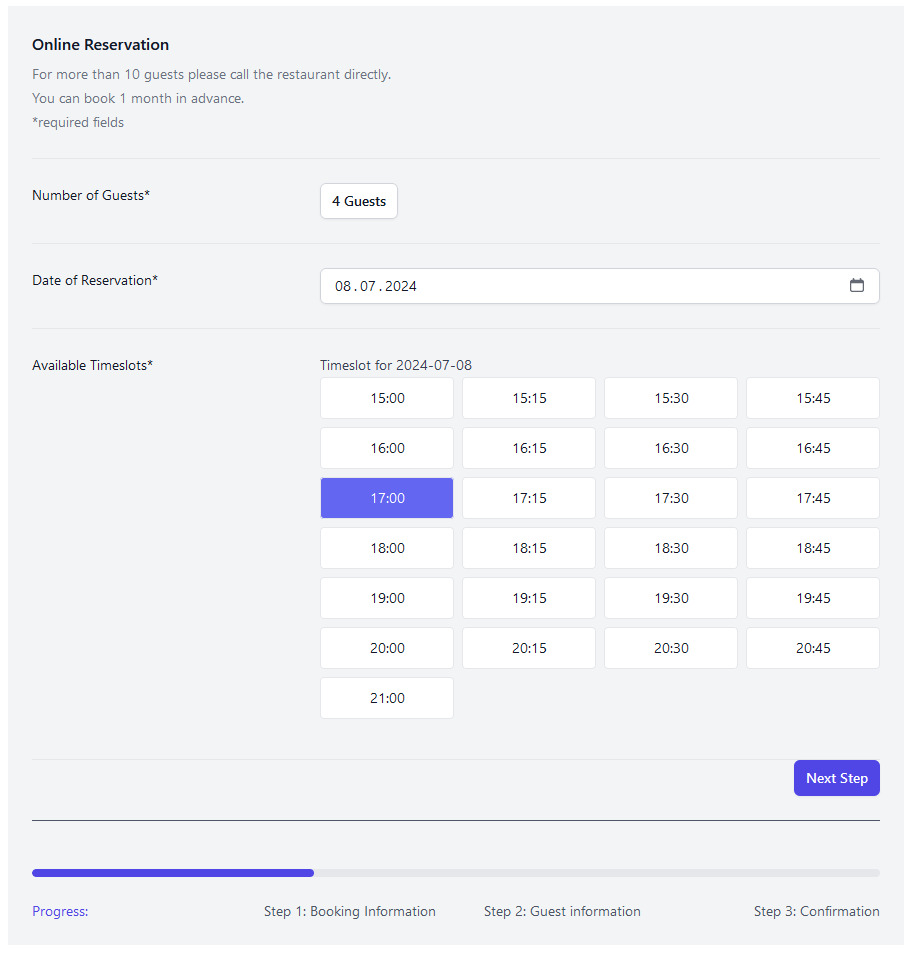
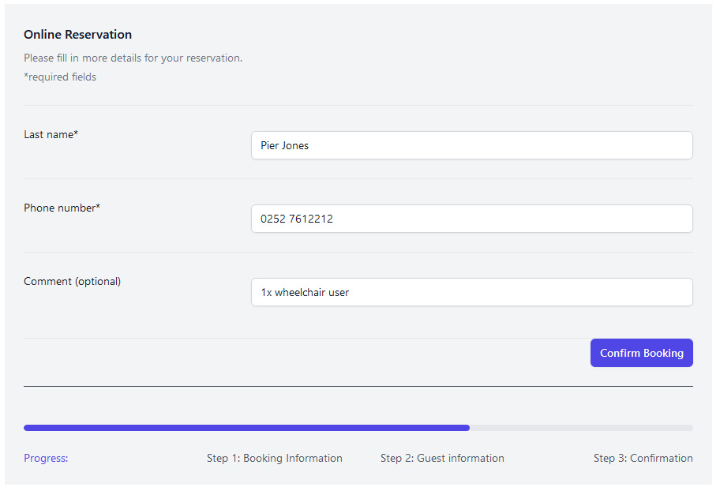

# PlatzKieker: User Documentation

## Table of Contents
- [Overview](#overview)
- [Restauranteur Perspective](#restauranteur-perspective)
    - [Accessing the Website](#accessing-the-website)
    - [Login/Register](#loginregister)
    - [Dashboard](#dashboard)
        - [Overview](#overview)
        - [Creating New Bookings](#creating-new-bookings)
        - [Editing Table Bookings](#editing-table-bookings)
    - [Settings](#settings)
        - [Overview](#overview-1)
        - [Restaurant Information and Zones & Tables](#restaurant-information-and-zones--tables)
            - [Restaurant Information](#restaurant-information)
            - [Zones](#zones)
            - [Tables](#tables)
        - [Booking Periods](#booking-periods)
        - [Vacations](#vacations)
- [Guest Perspective](#guest-perspective)
    - [Accessing the Website](#accessing-the-website-1)
    - [Online Reservation Process](#online-reservation-process)
        - [Booking Information](#booking-information)
        - [Guest Information](#guest-information)
        - [Confirmation](#confirmation)

## Overview

Welcome to Platzkieker, your go-to platform for online table reservations and restaurant management. This documentation provides a comprehensive guide to using Platzkieker from both the restauranteur's and the customer's perspective. 

## Restauranteur Perspective

### Accessing the Website

To access the website, type `platzkiecker.de` in your web browser. If you run it locally replace platzkiecker.de by localhost:3000 in the following.

### Login/Register

To access our website, users must [register](https://platzkiecker.de/register). An email and password of at least 5 characters are required.

If the user has already created an account, they can log in on our [login page](https://platzkiecker.de/login) using their email and password.

### Dashboard

Once you are logged in, you will see our Dashboard displaying the current table bookings.

#### Overview

The dashboard provides an overview of the reservations listed by the name of the person who made the reservation, also including the start and end time, the ID of the reserved table, the number of guests and any additional data.   Bookings can be filtered by date (today, tomorrow, etc.). The current status of the booking is displayed in the ‘Status’ column (canceled, confirmed, pending).

#### Creating New Bookings

With the ‘new booking’ button in the dashboard, a new mask named ‘Create booking’ opens, allowing bookings to be entered manually by the restauranteur. In case a guest books a table via phone or comes into the restaurant asking for a table, the restauranteur can book the table themselves.  The required data for a booking is the number of guests, the date and timeslot of the reservation, the last name of the Guest who is making the booking, and their phone number. In order to let the available timeslots be displayed, the number of guests always has to be filled out first. If there are no timeslots available for the chosen number of guests and/or the chosen day, this will be mentioned. It is also possible to add notes here. The booking is then created by clicking the 'create booking' button.

#### Editing Table Bookings

If a reservation needs to be corrected, existing reservations can be edited using the **Edit** button on the dashboard. This action opens the ‘Edit booking’ mask, where the name, phone number, notes and the status of the booking can be changed. The changes need to confirmed using the ‘Update booking’ button. It is also possible to delete the booking here using the 'delete booking' button.

### Settings

#### Overview

In the settings area the restauranteur can manually manage the settings of the restaurant according to their wishes. This includes the name of the restaurant, the default booking duration, the tables and the different zones in which the tables can be organised.   Note: restaurant name, default booking duration and tables as well as bookable periods are required to be able to create bookings.

#### Restaurant Information and Zones & Tables

##### Restaurant Information

The name of the restaurant can be entered in this area. You can also set a default value for the booking duration in hours by entering a number or using the up/down buttons.  
Note: 'Name' and 'Default booking duration' are required fields.

##### Zones

A restaurant can create various zones to organize its seating areas. A zone is defined by a name (e.g., 'Inside', 'Outside', 'Upstairs', 'Downstairs') and includes an attribute called 'bookable'. This attribute indicates whether the tables in that zone can be reserved.  
Note: 'Name' is a required field. 'Zone 1' is automatically created as the first zone after registration. A zone can only be deleted if there are no tables left in the specific zone.

![Zones] screenshot hinzufügen

##### Tables

A restaurant can create an individual table within a restaurant using the table module, including its name, the capacity, (if it is bookable, and the associated zone. muss klären, ob das im frontend sichtbar ist) A table ID will be automatically generated when creating a new table.  
Note: 'Capacity' and 'Zone' are required fields.

#### Booking Periods

In this area, the opening times of the restaurant can be set by pressing the ‘+’ button for entering the times corresponding to the days of the week. If needed, several time intervals can be entered per day to determine when the restaurant has its break time on that day. Thus, rest days can also easily be created by not determining any bookable periods on days the restaurant is closed.  
Note: booking periods are to be considered shorter by the lentgh of the previously set default booking duration.

#### Vacations

Restaurant holidays can be set in this tab. As soon as you click on the field, a calendar appears where you can set the time interval. Multiple vacation periods can be entered using the '+'.  
Note: if not booked at least one month in advance, all costumers who already booked a table in the affected time have to be notified manually.

## Guest Perspective

### Accessing the Website

To access the website, type `platzkiecker.de/tablereservation` in your web browser.

You will see our Online Reservation Portal.

### Online Reservation Process

The Online Reservation Process is divided into three steps:
1. Booking Information
2. Guest Information
3. Confirmation

#### Booking Information

The first step asks for the number of guests, the date of the reservation, and shows the available timeslots for the desired day. Confirm this step with the ‘Next Step’ button. If the number of guests is higher than 10, the customer is instructed to contact the restauranteur, as he can create bookings for 10 or more guests as well if there are suitable tables available. You can book up to one month in advance.   Note: in order to let the available timeslots be displayed, the number of guests always has to be filled out first. If there are no timeslots available for the chosen number of guests and/or the chosen day, this will be mentioned.

#### Guest Information

In the second step, the last name of the person making the booking is requested. A telephone number is also required for queries and confirmations. Specific details can be referenced in the 'Comment' area. 'Last name' and 'Phone number' fields must be filled out, the 'Comment' field is optional.

#### Confirmation

In the final step, a booking confirmation with the details of the booking is displayed. All data from the previous steps are summarized here (name, telephone number, comment, date, time, number of guests). The booking will then be displayed on the restaurant's dashboard.   Note: if something needs to be changed, the customer is instructed to contact the restaurant directly. 

